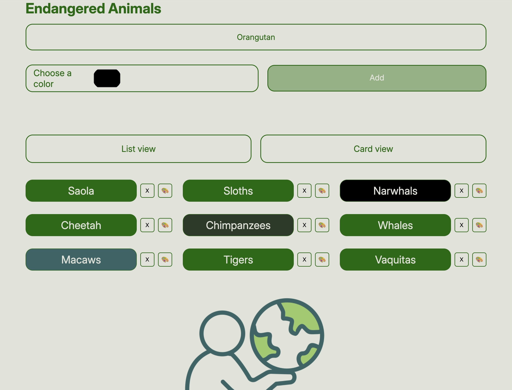
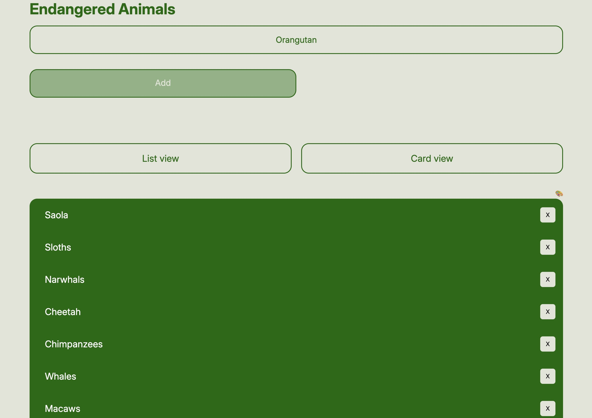

# Assignment 01

## Brief 

Starting from the concept of a pinboard, implement a web page that:

- is responsive (properly layout for smartphone, tablet, and desktop)
- allows the user to add and remove elements
- allows the user to coustomize elements (i.e. colors, size)
- allows the switch between two views (at least)

## Screenshots 

## Project description 

Starting from the concept of a pinboard, the idea was to create a space where the user can add endangered animal species. In addition, the user can delete an item or highlight a card in the card-view, or a container in the list-view. The buttons include hover and active states, and the design is responsive. 

## Function list 

1.listButton.addEventListener('click', …) - Switches the layout to list view 
2.cardButton.addEventListener('click', …) - Switches the layout to card view 
3.document.querySelectorAll('.delete-btn').forEach(btn => { … }) - Adds a click listener to every existing delete button  
4.btn.addEventListener('click', function () { ... }) - Removes the parent element of the clicked delete button 
5.addButton.addEventListener('click', …) - Adds a new animal to the list 
6.deleteBtn.addEventListener('click', …) - Removes the current animal container when the “X” button is clicked 
7.animalList.addEventListener('click', …) - Handles color editing for each card  
8.toHex = (rgbStr) => { ... } - Converts an RGB color string into a HEX color string 
9.listBgPicker.addEventListener('input', …) - Changes the background color of the list container when in list-view mode.

